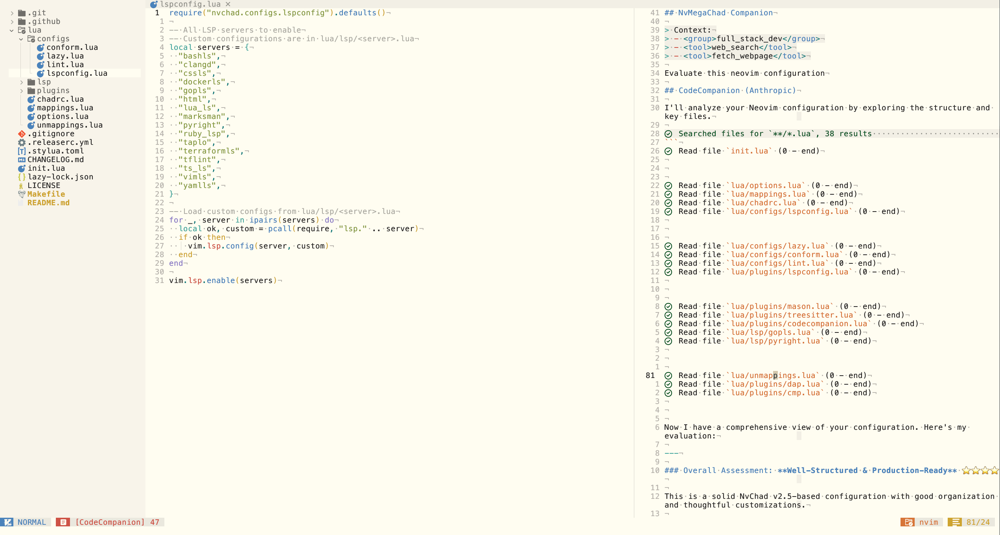

# NvMegaChad


<p align="center">
  
</p>

A batteries-included [Neovim](https://neovim.io/) configuration built on top of [NvChad](https://nvchad.com/). Designed with a minimal UI philosophy while providing comprehensive out-of-the-box support for modern development workflows.

## ✨ Features

- **Minimal UI** — Clean interface with thoughtfully designed key mappings
- **Multi-language Support** — 16 languages with LSP, formatting, and linting
- **Debugging** — Integrated DAP support for Go and Python
- **AI Assistant** — Built-in [CodeCompanion](https://github.com/olimorris/codecompanion.nvim) integration
- **Markdown Preview** — Live preview for documentation workflows
- **Git Integration** — Visual commit history and diff tools

## 📸 Screenshots

<details>
<summary>Click to expand</summary>

### AI Companion



### Editor


### Search


### Git Commits


### Debugger


### Markdown Preview


### Cheatsheet


</details>

## 📋 Requirements

| Dependency                                                      | Version | Notes                           |
| --------------------------------------------------------------- | ------- | ------------------------------- |
| [Neovim](https://github.com/neovim/neovim/releases/tag/v0.11.0) | 0.11.0+ | Required                        |
| [Nerd Font](https://www.nerdfonts.com/)                         | Any     | Hack Nerd Font recommended      |
| [Ripgrep](https://github.com/BurntSushi/ripgrep)                | Latest  | For fuzzy finding               |
| [Terraform](https://www.terraform.io/)                          | Latest  | Optional, for Terraform support |

> **Tip:** All dependencies can be installed automatically by running `make install`

## 🚀 Installation

### Quick Install

```sh
# Backup and remove existing config
mv ~/.config/nvim ~/.config/nvim.bak
mv ~/.local/share/nvim ~/.local/share/nvim.bak

# Clone and install
git clone https://github.com/le4ker/NvMegaChad ~/.config/nvim
cd ~/.config/nvim
make install
nvim
```

### Try Without Overwriting Your Config

> ⚠️ Always review the code before installing a configuration.

```sh
git clone git@github.com:le4ker/NvMegaChad ~/.config/le4ker/NvMegaChad
cd ~/.config/le4ker/NvMegaChad
make install
NVIM_APPNAME=le4ker/NvMegaChad nvim
```

## 🗣️ Supported Languages

| Language              | LSP                                                                                                                                      | Formatter                                                                        | Linter                                                     | Debugger                                        |
| --------------------- | ---------------------------------------------------------------------------------------------------------------------------------------- | -------------------------------------------------------------------------------- | ---------------------------------------------------------- | ----------------------------------------------- |
| Go                    | [gopls](https://pkg.go.dev/golang.org/x/tools/gopls)                                                                                     | gofmt, goimports                                                                 | [golangci-lint](https://golangci-lint.run/)                | [delve](https://github.com/go-delve/delve)      |
| Python                | [pyright](https://github.com/microsoft/pyright)                                                                                          | [black](https://github.com/psf/black), [isort](https://github.com/PyCQA/isort)   | [pylint](https://pylint.org/)                              | [debugpy](https://github.com/microsoft/debugpy) |
| C/C++                 | [clangd](https://clangd.llvm.org)                                                                                                        | [clang-format](https://www.kernel.org/doc/html/latest/process/clang-format.html) | —                                                          | —                                               |
| Lua                   | [lua-language-server](https://github.com/LuaLS/lua-language-server)                                                                      | [stylua](https://github.com/JohnnyMorganz/StyLua)                                | —                                                          | —                                               |
| Ruby                  | [ruby-lsp](https://github.com/Shopify/ruby-lsp)                                                                                          | [rubocop](https://github.com/rubocop/rubocop)                                    | [rubocop](https://github.com/rubocop/rubocop)              | —                                               |
| TypeScript/JavaScript | [typescript-language-server](https://github.com/typescript-language-server/typescript-language-server)                                   | [prettier](https://github.com/prettier/prettier)                                 | —                                                          | —                                               |
| HTML/CSS/SCSS         | [html-lsp](https://github.com/microsoft/vscode-html-languageservice), [css-lsp](https://github.com/microsoft/vscode-css-languageservice) | [prettier](https://github.com/prettier/prettier)                                 | —                                                          | —                                               |
| JSON/GraphQL          | —                                                                                                                                        | [prettier](https://github.com/prettier/prettier)                                 | —                                                          | —                                               |
| YAML                  | [yaml-language-server](https://github.com/redhat-developer/yaml-language-server)                                                         | [prettier](https://github.com/prettier/prettier)                                 | —                                                          | —                                               |
| Markdown              | [marksman](https://github.com/artempyanykh/marksman)                                                                                     | [prettier](https://github.com/prettier/prettier)                                 | [markdownlint](https://github.com/DavidAnson/markdownlint) | —                                               |
| Bash                  | [bash-language-server](https://github.com/bash-lsp/bash-language-server)                                                                 | [shfmt](https://github.com/mvdan/sh)                                             | —                                                          | —                                               |
| Dockerfile            | [dockerfile-language-server](https://github.com/rcjsuen/dockerfile-language-server-nodejs)                                               | —                                                                                | —                                                          | —                                               |
| Terraform             | [terraform-ls](https://github.com/hashicorp/terraform-ls)                                                                                | [terraform_fmt](https://developer.hashicorp.com/terraform/cli/commands/fmt)      | [tflint](https://github.com/terraform-linters/tflint)      | —                                               |
| TOML                  | [taplo](https://taplo.tamasfe.dev/)                                                                                                      | [taplo](https://taplo.tamasfe.dev/)                                              | —                                                          | —                                               |
| Vimscript             | [vim-language-server](https://github.com/iamcco/vim-language-server)                                                                     | —                                                                                | —                                                          | —                                               |
| SQL                   | —                                                                                                                                        | [sql-formatter](https://github.com/sql-formatter-org/sql-formatter)              | —                                                          | —                                               |

## 📄 License

See [LICENSE](LICENSE) for details.
