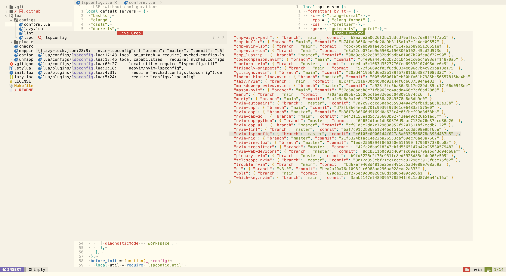
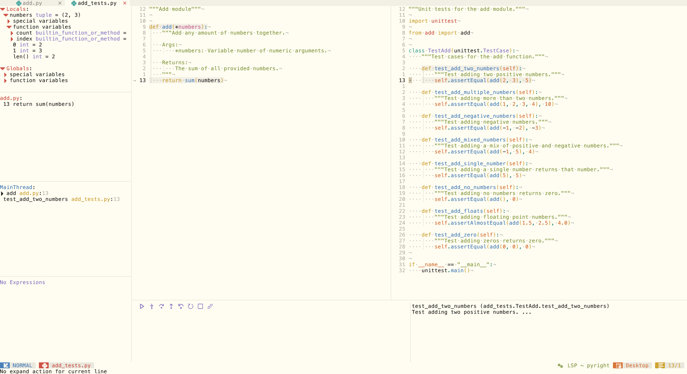
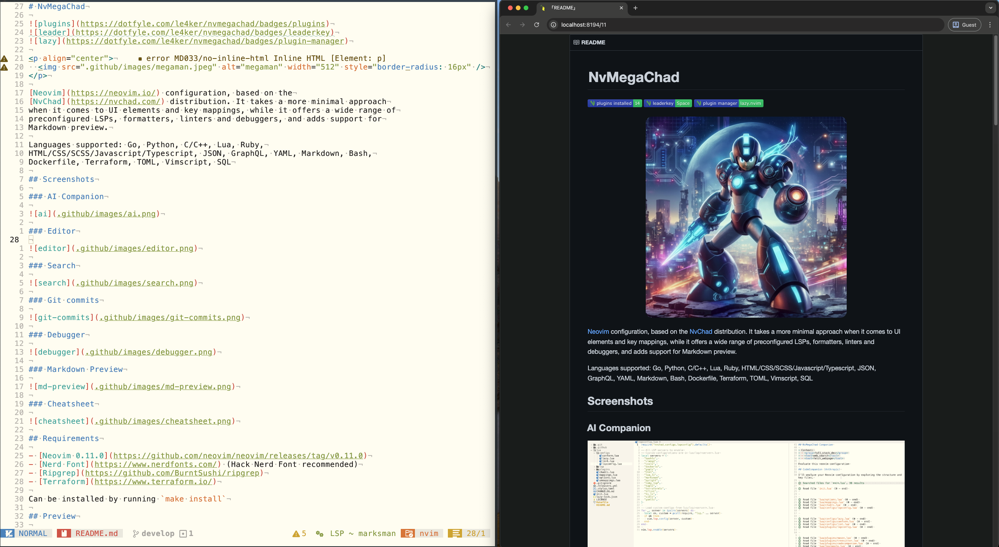

# NvMegaChad


<p align="center">
  
</p>

[Neovim](https://neovim.io/) configuration, based on the
[NvChad](https://nvchad.com/) distribution. It takes a more minimal approach
when it comes to UI elements and key mappings, while it offers a wide range of
preconfigured LSPs, formatters, linters and debuggers, and adds support for
Github Copilot and Markdown preview.

Languages supported: Go, Python, C/C++, Lua, Ruby,
HTML/CSS/Javascript/Typescript, YAML, Bash, Terraform, TOML, Vimscript, SQL

## Requirements

- [Neovim 0.9.0](https://github.com/neovim/neovim/releases/tag/v0.9.0)
- [Nerd Font](https://www.nerdfonts.com/)
- [Ripgrep](https://github.com/BurntSushi/ripgrep)
- [Terraform](https://www.terraform.io/)

Can be installed in macOS by running `make install`

## Preview

> Install requires Neovim 0.9+. Always review the code before installing a
> configuration.

Clone the repository and install the plugins:

```sh
git clone git@github.com:le4ker/NvMegaChad ~/.config/le4ker/NvMegaChad
make install # works only on macOS
NVIM_APPNAME=le4ker/NvMegaChad/ nvim
```

## Install

Remove existing config:

```sh
rm -rf ~/.config/nvim
rm -rf ~/.local/share/nvim
```

Download the config and install the dependencies:

```sh
git clone https://github.com/le4ker/NvMegaChad ~/.config/nvim
cd ~/.config/nvim
make install # works only on macOS
nvim
```

## Language Servers

- [bash-language-server](https://github.com/bash-lsp/bash-language-server)
- [clangd](https://clangd.llvm.org)
- [css-lsp](https://github.com/microsoft/vscode-css-languageservice)
- [dockerfile-language-server](https://github.com/rcjsuen/dockerfile-language-server-nodejs)
- [gopls](https://pkg.go.dev/golang.org/x/tools/gopls)
- [html-lsp](https://github.com/microsoft/vscode-html-languageservice)
- [lua-language-server](https://github.com/LuaLS/lua-language-server)
- [marksman](https://github.com/artempyanykh/marksman)
- [pyright](https://github.com/microsoft/pyright)
- [ruby-lsp](https://github.com/Shopify/ruby-lsp)
- [taplo](https://taplo.tamasfe.dev/)
- [terraform-ls](https://github.com/hashicorp/terraform-ls)
- [typescript-language-server](https://github.com/typescript-language-server/typescript-language-server)
- [vim-language-server](https://github.com/iamcco/vim-language-server)
- [yaml-language-server](https://github.com/redhat-developer/yaml-language-server)

## Formatters

- [black](https://github.com/psf/black)
- [clang-format](https://www.kernel.org/doc/html/latest/process/clang-format.html)
- [gofmt](https://pkg.go.dev/cmd/gofmt)
- [isort](https://github.com/PyCQA/isort)
- [prettier](https://github.com/prettier/prettier)
- [rubocop](https://github.com/rubocop/rubocop)
- [shfmt](https://github.com/mvdan/sh)
- [sql-formatter](https://github.com/sql-formatter-org/sql-formatter)
- [stylua](https://github.com/JohnnyMorganz/StyLua)
- [terraform_fmt](https://developer.hashicorp.com/terraform/cli/commands/fmt)

## Linters

- [golangci-lint](https://golangci-lint.run/)
- [markdownlint](https://github.com/DavidAnson/markdownlint)
- [pylint](https://pylint.org/)
- [rubocop](https://github.com/rubocop/rubocop)
- [tflint](https://github.com/terraform-linters/tflint)

## Debuggers

- [delve](https://github.com/go-delve/delve)
- [debugpy](https://github.com/microsoft/debugpy)

## Screenshots

### Editor


### Github Copilot


### Search



### Git commits


### Debugger



### Markdown Preview



### Cheatsheet


