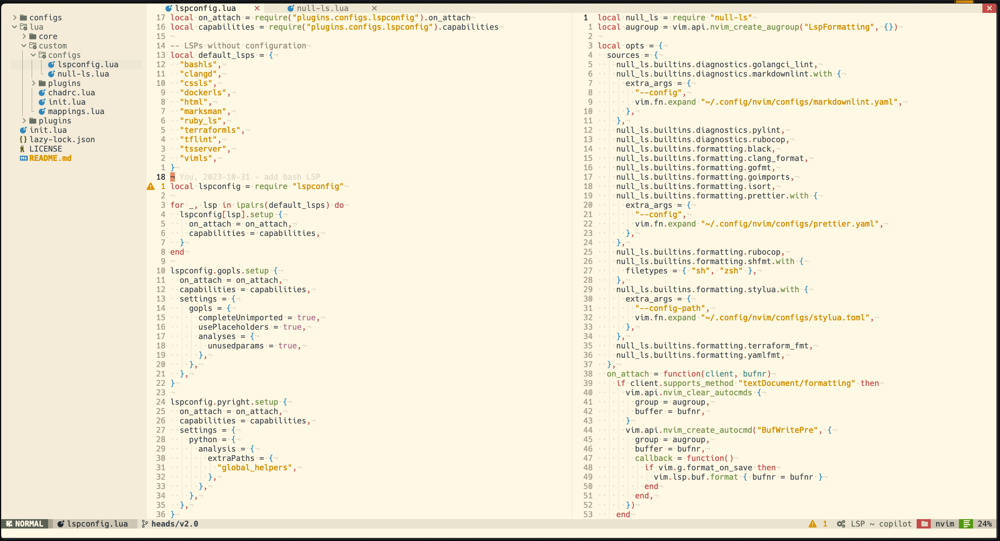
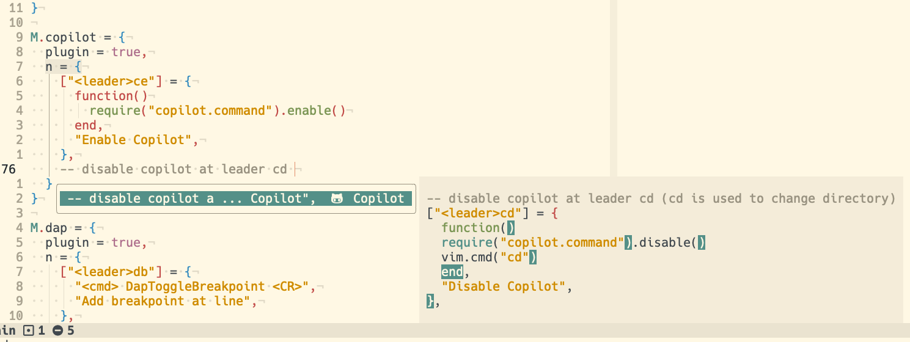
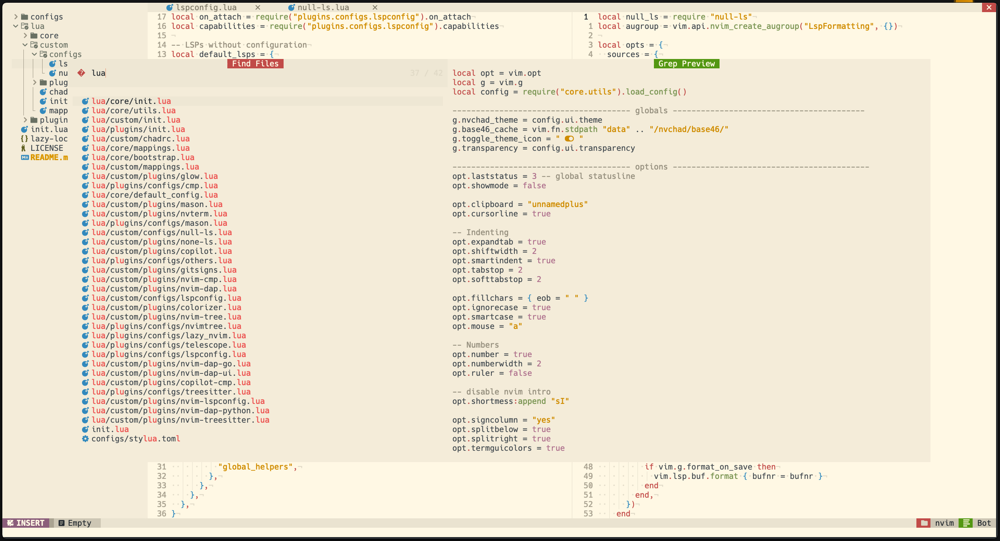
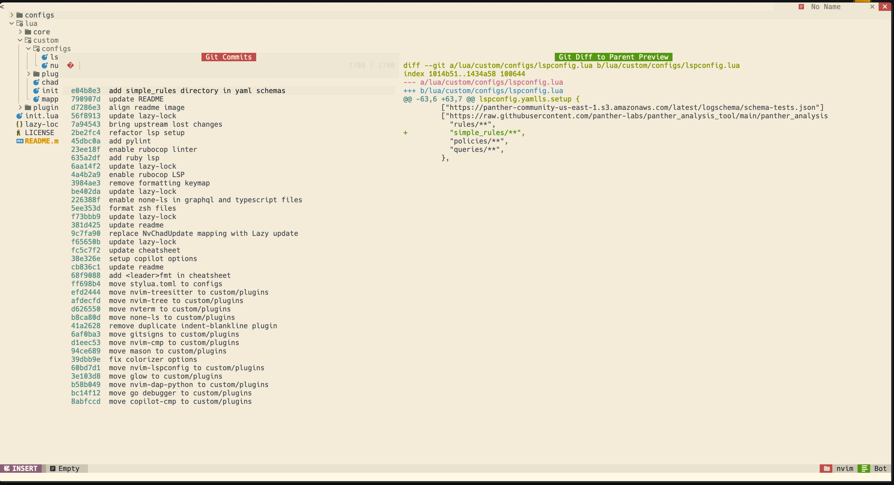
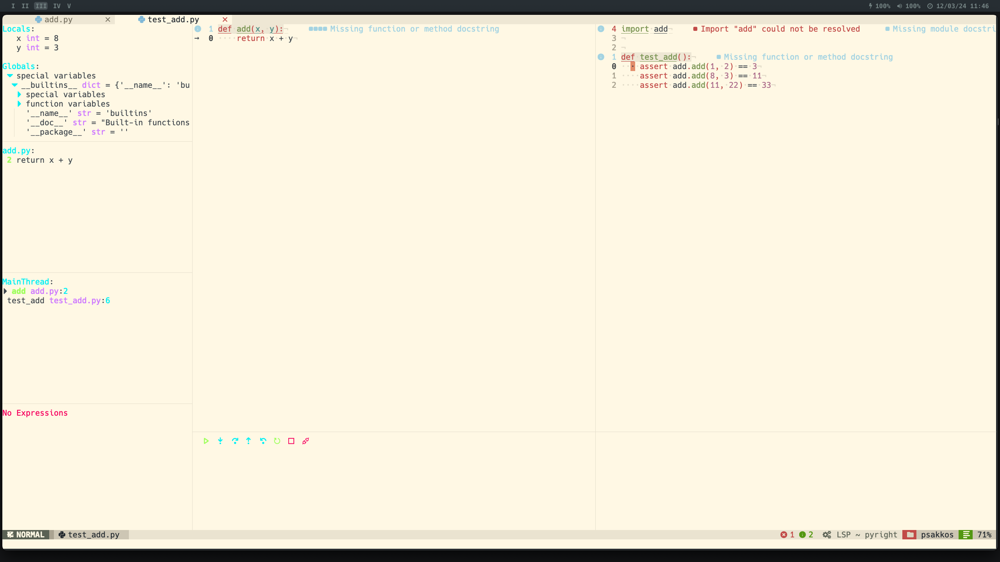
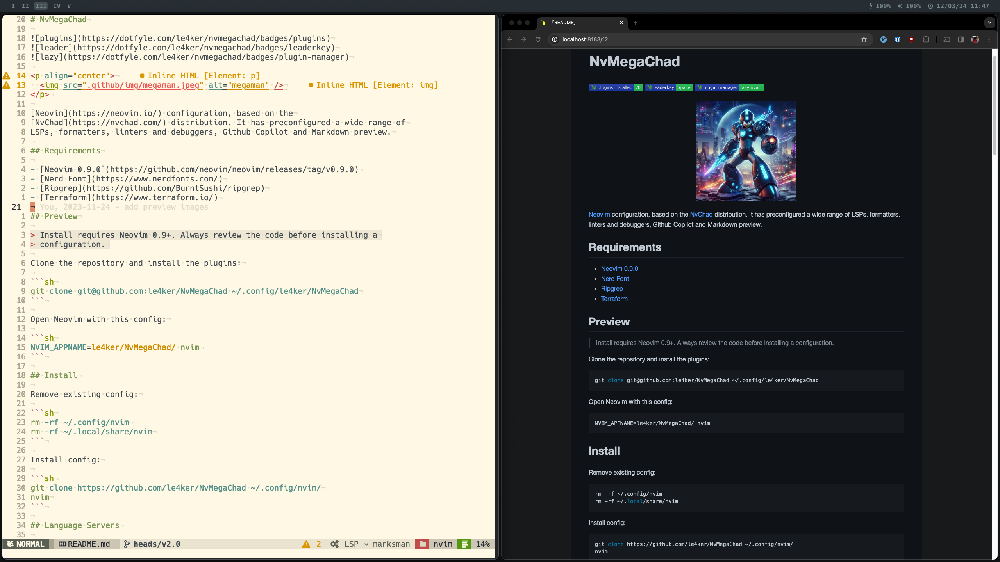
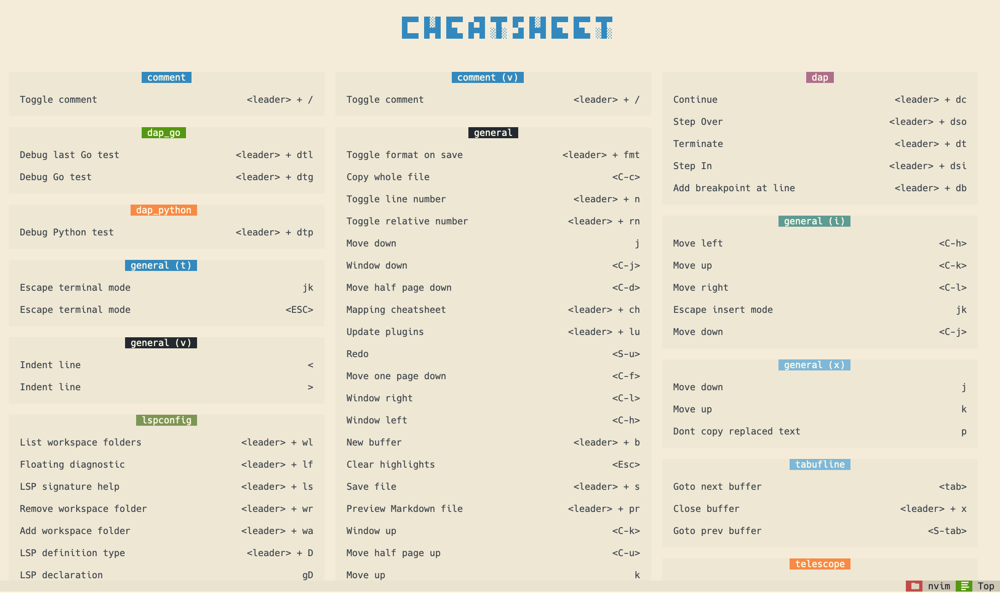

# NvMegaChad


<p align="center">
  
</p>

[Neovim](https://neovim.io/) configuration, based on the
[NvChad](https://nvchad.com/) distribution. It has preconfigured a wide range of
LSPs, formatters, linters and debuggers, Github Copilot and Markdown preview.

## Requirements

- [Neovim 0.9.0](https://github.com/neovim/neovim/releases/tag/v0.9.0)
- [Nerd Font](https://www.nerdfonts.com/)
- [Ripgrep](https://github.com/BurntSushi/ripgrep)
- [Glow](https://github.com/charmbracelet/glow)
- [Terraform](https://www.terraform.io/)

## Preview

> Install requires Neovim 0.9+. Always review the code before installing a
> configuration.

Clone the repository and install the plugins:

```sh
git clone git@github.com:le4ker/NvMegaChad ~/.config/le4ker/NvMegaChad
```

Open Neovim with this config:

```sh
NVIM_APPNAME=le4ker/NvMegaChad/ nvim
```

## Install

Remove existing config:

```sh
rm -rf ~/.config/nvim
rm -rf ~/.local/share/nvim
```

Install config:

```sh
git clone https://github.com/le4ker/NvMegaChad ~/.config/nvim/
nvim
```

## Language Servers

- bash-language-server
- clangd
- css-lsp
- dockerfile-language-server
- gopls
- html-lsp
- lua-language-server
- marksman
- pyright
- ruby-lsp
- terraform-ls
- tflint
- typescript-language-server
- vim-language-server
- yaml-language-server

## Formatters

- black
- clang-format
- gofmt
- isort
- markdownlint
- prettier
- rubocop
- shfmt
- stylua
- terraform_fmt
- yamlfmt

## Linters

- golangci-lint
- markdownlint
- pylint
- rubocop
- tflint

## Debuggers

- delve
- debugpy

## Fetching upstream changes

Add the upstream repository as a remote:

```sh
git remote add upstream https://github.com/NvChad/NvChad.git
```

And then you can rebase your local changes after fetching the upstream:

```sh
git fetch upstream
git rebase upstream/v2.0
```

## Screenshots

### Editor



### Github Copilot



### Search



### Git commits



### Debugger



### Markdown Preview



### Cheatsheet


